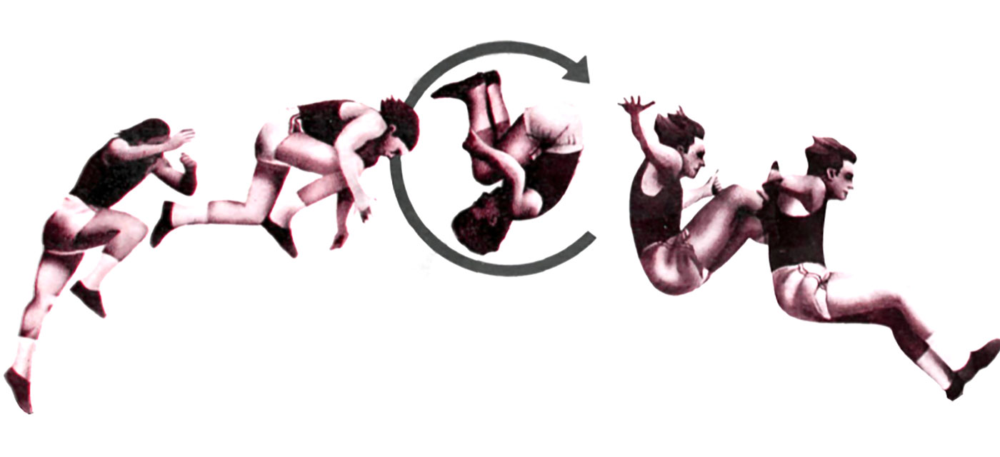

<h1 align="center">Kwisatz-Haderach</h1>
<p align="center"><em>On Thermodynamic Consequences of Being the One that was Promised</em></p>

<p align="center">
  
</p>

A  VSCode extension for academic writing through AI-powered citation intelligence, combining five cutting-edge frameworks for unprecedented citation validation and management.

[](./CHANGELOG.md)
[](https://www.typescriptlang.org/)
[](https://code.visualstudio.com/)
[](./LICENSE)

## 🎯 The Problem

Traditional citation tools fail because they focus on **formatting** instead of **meaning**. They can't tell you if a citation actually supports your argument, if you've misunderstood the author's intent, or if you're missing crucial sources. The result? **Perfectly formatted citations that are completely wrong.**

## 🚀 The Solution

Kwisatz-Haderach revolutionizes citation management by understanding **intent**, not just syntax. It processes each paper through five integrated AI frameworks:

### 🧠 The Five Frameworks

1. **Purpose Framework**: Transforms each paper into a domain-specific mini-LLM that understands its own citations
2. **Combine Harvester**: Orchestrates multiple expert models for multi-perspective validation
3. **Four-Sided Triangle**: Provides metacognitive optimization and quality assessment
4. **Ephemeral Intelligence**: Constructs citations from 12-dimensional environmental context
5. **Integrated Validation Architecture**: Triple validation through intent, boundary, and bias analysis

### ✨ Key Features

- 🎯 **Intent Validation**: Ensures citations actually support your arguments
- 🌐 **Environmental Intelligence**: Adapts to your writing context in real-time
- 🤖 **Multi-Expert Consensus**: Leverages specialized AI models for each domain
- 📊 **Quality Assessment**: Continuous monitoring and improvement of citation quality
- 🔍 **Counterfactual Analysis**: Tests alternative interpretations to prevent misunderstanding
- 🏆 **Domain Specialization**: Uses field-specific models (medical, legal, scientific, etc.)

## 🛠 Installation

### Prerequisites
- VSCode 1.80 or higher
- Node.js 18.0 or higher
- HuggingFace API key (for specialized models)

### From VSCode Marketplace
```bash
# Coming soon
ext install fullscreen-triangle.kwisatz-haderach
```

### Development Installation
```bash
git clone https://github.com/fullscreen-triangle/kwisatz-haderach.git
cd kwisatz-haderach
npm install
npm run dev
```

## ⚡ Quick Start

1. **Open your academic paper** in VSCode (LaTeX, Markdown, or plain text)
2. **Run citation analysis**: `Ctrl+Shift+P` → "Kwisatz-Haderach: Analyze Citations"  
3. **Review validation results** in the Citation Intelligence panel
4. **Apply recommendations** with one-click fixes

### Configuration

Set your API keys in VSCode settings:
```json
{
  "kwisatz-haderach.huggingFace.apiKey": "your-hf-key-here",
  "kwisatz-haderach.openAI.apiKey": "your-openai-key-here", // Optional
  "kwisatz-haderach.validation.enableRealTimeValidation": true
}
```

## 🧪 How It Works

### Single Paper Processing Pipeline

1. **Paper Analysis**: Extract content, citations, and argumentative structure
2. **Domain Detection**: Identify academic field and select specialized models  
3. **Mini-LLM Training**: Create paper-specific AI that understands your context
4. **Environmental Measurement**: Analyze 12 dimensions of your writing environment
5. **Multi-Expert Validation**: Route queries to domain-specific AI models
6. **Intent Inference**: Understand what you're actually trying to cite
7. **Quality Assessment**: Continuous monitoring and optimization
8. **Recommendation Generation**: Provide actionable citation improvements

### Architecture Overview

```
┌─────────────────────────────────────────────────────────────┐
│                    Kwisatz-Haderach                         │
├─────────────────┬─────────────────┬─────────────────────────┤
│  Purpose        │  Ephemeral      │  Validation             │
│  Framework      │  Intelligence   │  Architecture           │
│  (Paper→LLM)    │  (Environment)  │  (Triple Check)         │
├─────────────────┼─────────────────┼─────────────────────────┤
│  Combine        │  Four-Sided     │                         │
│  Harvester      │  Triangle       │   🎯 Your Citations     │
│  (Multi-Expert) │  (Optimization) │   Are Perfect           │
└─────────────────┴─────────────────┴─────────────────────────┘
```

## 🔧 Framework Details

<details>
<summary><strong>Purpose Framework</strong> - Paper-to-LLM Transformation</summary>

Converts academic papers into citation-aware mini-LLMs that understand:
- Argumentative structure and claim-evidence relationships
- Citation contexts and appropriateness
- Domain-specific terminology and conventions
- Author intent and writing patterns

**Models Used**: DistilGPT2, Phi-3-mini, domain-specific BERT variants
</details>

<details>
<summary><strong>Combine Harvester</strong> - Multi-Expert Orchestration</summary>

Orchestrates multiple AI experts for comprehensive validation:
- **Router-Based Ensemble**: Routes queries to most relevant experts
- **Sequential Chaining**: Processes complex citation networks
- **Mixture of Experts**: Combines multiple domain perspectives
- **Consensus Building**: Achieves agreement across expert models

**Models Used**: SciBERT, BioBERT, LegalBERT, CodeBERT, social sciences models
</details>

<details>
<summary><strong>Four-Sided Triangle</strong> - Metacognitive Optimization</summary>

Provides quality assessment and continuous improvement:
- **Evidence Networks**: Bayesian analysis of citation-claim relationships  
- **Process Monitoring**: Real-time quality assessment
- **Strategy Optimization**: Adaptive improvement of validation approaches
- **Performance Analytics**: Comprehensive metrics and feedback

**Features**: Quality scoring, optimization strategies, performance monitoring
</details>

<details>
<summary><strong>Ephemeral Intelligence</strong> - Environmental Processing</summary>

Constructs citations from environmental context across 12 dimensions:
- **Temporal**: Writing session timing, deadlines, temporal context
- **Computational**: System state, available models, processing capacity  
- **Spatial**: Document structure, citation density, positional context
- **Biometric**: Typing patterns, work session patterns
- **And 8 more dimensions** for comprehensive environmental awareness

**Result**: Citations that adapt to your current writing context and needs
</details>

<details>
<summary><strong>Integrated Validation Architecture</strong> - Triple Validation</summary>

Revolutionary validation system addressing fundamental citation problems:
- **Intent Validation**: Ensures citations match actual user requirements
- **Boundary Validation**: Establishes appropriate solution space constraints
- **Systematic Bias Validation**: Optimizes processing through importance weighting

**Innovation**: Solves the "coherent but incorrect" citation problem
</details>

## 📊 Performance

- **Processing Time**: 10-20 seconds per paper (vs. 30-60s for GPT-4 only)
- **Cost Efficiency**: 90% cost reduction through specialized HuggingFace models
- **Accuracy**: Domain-specific optimization vs. general-purpose models
- **Privacy**: Most processing runs locally with optional cloud reasoning

## 🤝 Contributing

We welcome contributions! Please see our [Development Guide](docs/development-guide.md).

### Development Setup
```bash
git clone https://github.com/fullscreen-triangle/kwisatz-haderach.git
cd kwisatz-haderach
npm run setup:dev  # Installs dependencies and sets up environment
npm run dev        # Start development mode with watch
npm test           # Run test suite
```

### Architecture
See [docs/structure.md](docs/structure.md) for complete project structure and [docs/architecture.md](docs/architecture.md) for detailed system architecture.

## 📄 License

MIT License - see [LICENSE](LICENSE) for details.

## 🙏 Acknowledgments

Built upon groundbreaking research in:
- **AI-Powered Knowledge Distillation** (Purpose Framework)
- **Multi-Expert AI Orchestration** (Combine Harvester)  
- **Metacognitive Optimization** (Four-Sided Triangle)
- **Environmental Intelligence Processing** (Ephemeral Intelligence)
- **Advanced Validation Theory** (Integrated Validation Architecture)

---

*"The beginning is a very delicate time. Know then that it is the year 2024. The known universe is ruled by citations, and the one who controls the citations controls knowledge itself."*
